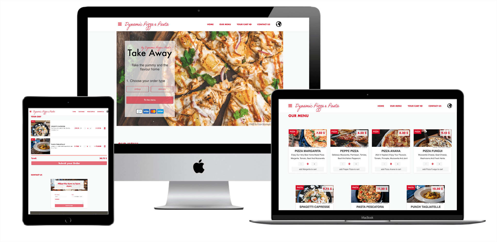

# Dynamic Restaurant Page

> This project implements DOM manipulation by dynamically rendering a simple restaurant homepage.



# Project Details
- The project uses JavaScript alone to generate the entire contents of the website.
- The project uses webpack to organise and simplify project building. 
- Each section in the navigation bar is generated by a module located in the src/components folder. 
- Each module exports a function that creates a div element, including each HTML tag and CSS Id and classes that will render the expected view.
- The file src/index.js build the tab-switching logic. Event listeners will be attached to each navigation menu item, that will further fire the correct function.
- As per requirements, each function will wipe-out the previously rendered HTML tags, and dynamically regenerate the required content for the selected menu item. 

## Built With

- HTML/CSS, Javascript, Webpack, NPM, yarn.
- ESlint, Stylelint
- VSCode

## Live Demo

[Live Demo Link](https://rawcdn.githack.com/canriquez/dynamic-restaurant/105e651cacb66ea1278b1a143603c746b2e909b9/dist/index.html)


## Getting Started


To get a local copy up and running, follow these simple example steps.

### Prerequisites
- To install the app in your system, make sure you have node/npm installed. [get npm](https://www.npmjs.com/get-npm)

### Setup
- Clone the repository in your system by using: 

``` git clone https://github.com/canriquez/dynamic-restaurant.git ```

### Install
- Next step is to CD into the local repository and run:

``` $ npm install ```


## Author

👤 ***Carlos Anriquez***

- Github: [@canriquez](https://github.com/canriquez)
- Twitter: [@cranriquez](https://twitter.com/cranriquez)
- Linkedin: [linkedin](https://www.linkedin.com/in/carlosanriquez/)
- Portfolio: [carlosanriquez.com](https://www.carlosanriquez.com)

## 🤝 Contributing

Contributions, issues and feature requests are welcome!

Feel free to check the [issues page](issues/).

## Show your support

Give a ⭐️ if you like this project!

## Acknowledgments

- Family, always my family.
- The Beagles!

## 📝 License

This project is [MIT](./LICENSE) licensed.
